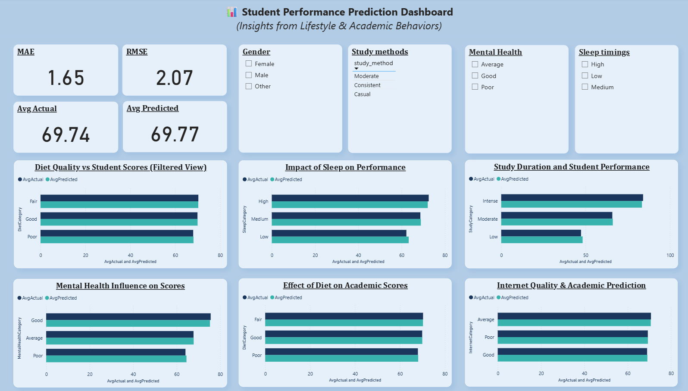

# Student Performance Dashboard

This Power BI dashboard predicts and analyzes student academic performance using lifestyle and behavioral factors such as sleep, diet quality, study duration, mental health, and internet quality.

## Features
- Student performance prediction
- KPI metrics (MAE, RMSE)
- Interactive slicers and filters
- Comparative visual analysis
- Academic trend insights

## Tools Used
- Power BI
- Data Visualization
- Predictive Analytics

## Dashboard Preview

## Note
Dataset files are not included in this repository.